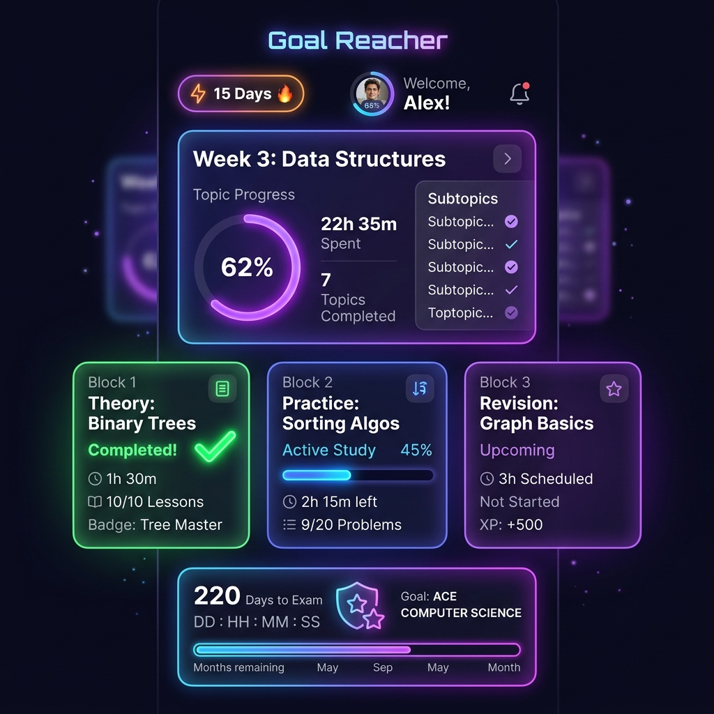

# Goal Reacher (Scroll Stopper) 🚀



**Goal Reacher** is a native Android application designed to help students and aspirants prepare for competitive exams. It functions as a gamified study companion, integrating a week-by-week roadmap planner, customizable daily study blocks, performance analytics, and a powerful **Scroll-Stopper Accessibility Service** that shields users from endless social media scroll addiction (e.g. YouTube Shorts).

---

## 🌟 Key Features

### 1. Scroll-Stopper Focus Shield (Accessibility Service)
* **Infinite Scroll Block**: Monitors screen navigation to detect infinite scrolling feeds (like YouTube Shorts). Once a set scroll limit is exceeded during study blocks, the app overlays a blocker, enforcing a strict pause.
* **Educational Whitelist**: Smart detection suspends the blocker if you are watching lectures on whitelisted educational channels (such as *Gate Smashers*, *Neso Academy*, *NPTEL*, or *Ravindrababu*).

### 2. AI Quest Planner (Offline & Online)
* **Offline Presets**: Instant, high-quality, pre-packaged study roadmaps for:
  * **GATE EEE** (Default)
  * **GATE CSE** (Discrete Math, OS, Networks, DBMS, TOC, etc.)
  * **RRB NTPC** & **RRB ALP** (Railway exams)
  * **UPSC CSE** (Polity, History, Geography, CSAT)
  * **GRE**
* **Gemini-Powered Custom Planning**: Enter any exam (e.g. *"GATE Civil"*, *"Actuarial Science"*) along with your Gemini API Key. The app calls Google's Gemini LLM to research exam dates, extract top online resources, and construct a tailored week-by-week syllabus.

### 3. Dynamic Timetables & Custom Blocks
* Customize study block names (e.g., *Block 1: Math Theory*, *Block 2: PYQs*) and target time-ranges.
* Edits instantly sync across the **Dashboard study cards**, the **Daily Study Timeline**, notifications, and the home screen widget.

### 4. Duolingo-style Home Screen Widget
* A native widget displaying your active study streak (🔥) and a checklist of completed daily blocks.
* Shows your current week's study topic and dynamic motivational reminders (e.g., *"GATE CSE Quest is fully secured today! 🌟"*).

### 5. Advanced Error Log (Mistake Tracker)
* Log mistakes with descriptions, subject categories, and failure types (Calculation, Conceptual, Speed, Misreading).
* Filter cards by solved status, subject, or reason, with cross-out visual feedback for solved items.

### 6. Performance Analytics
* Visualizes your discipline and consistency with custom Compose canvas-drawn charts mapping weekly XP gains.

---

## 🛠️ Tech Stack
* **Language**: Kotlin
* **Framework**: Jetpack Compose (Modern Declarative UI)
* **Android Components**: `AccessibilityService` (for focus shield), `AppWidgetProvider` (for native widgets), `BroadcastReceiver` & `AlarmManager` (for schedule reminders).
* **AI Integration**: Direct Gemini REST API integration using native Android HTTP queries and JSON parsing (no heavy external SDKs).
* **Storage**: Android SharedPreferences with custom object serialization.

---

## 🚀 How to Build & Run

### Prerequisites
* Android Studio (Ladybug or newer recommended)
* Android SDK (Compile & Target SDK: 36)
* JDK 17

### Building from Command Line
To compile and assemble the debug APK:

1. Clone the repository:
   ```bash
   git clone https://github.com/boddulikhith7/Goal-Reacher.git
   cd Goal-Reacher
   ```
2. Build the project:
   * **Windows (PowerShell)**:
     ```powershell
     $env:JAVA_HOME="C:\Program Files\Microsoft\jdk-17.0.19.10-hotspot"
     .\gradlew.bat assembleDebug
     ```
   * **Linux / macOS**:
     ```bash
     export JAVA_HOME="/path/to/jdk-17"
     ./gradlew assembleDebug
     ```
3. Install the APK on your connected device:
   ```bash
   adb install app/build/outputs/apk/debug/app-debug.apk
   ```

### Enabling the Scroll Stopper Shield
1. Install the app on your phone.
2. Go to Android **Settings** -> **Accessibility**.
3. Under installed services, select **Goal Reacher Scroll Shield** and toggle it **On**.
4. *(Note: Allow restricted settings if prompted by Android's security policies).*
